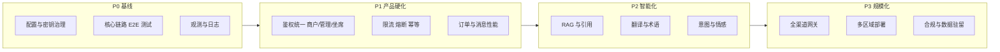
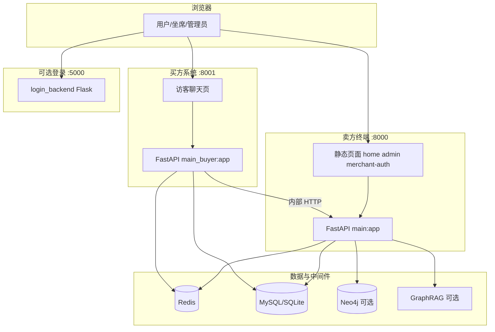
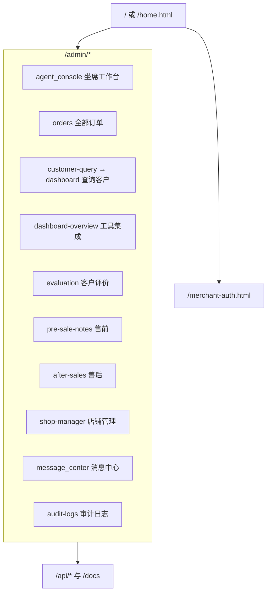
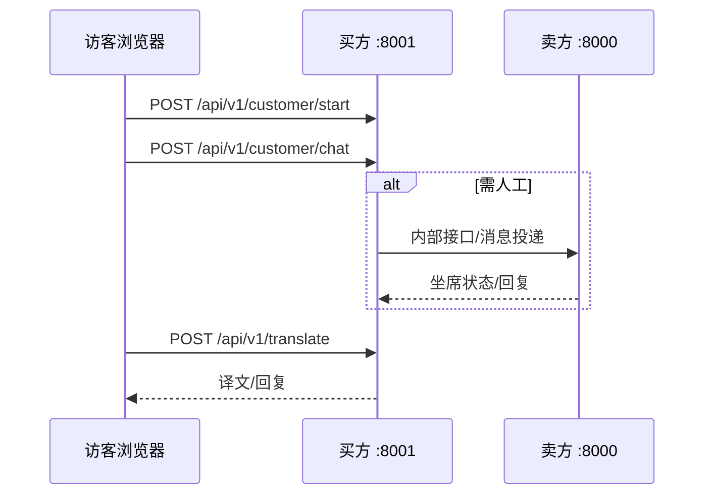

# Ruitalk 智能客服系统 — 功能总结、缺陷、改进方向与技术路线

> 文档位置：项目根目录  
> 目的：汇总**已实现能力**、**已知缺陷**、**待改进项**，并给出**技术路线图**与**站点/系统结构图**（便于评审与迭代）。  
> 说明：部分内容结合仓库代码与 `docs/` 历史报告；生产部署前请以实机配置与安全审计为准。

---

## 一、项目定位与组成

Ruitalk 面向**跨境电商客服**场景，将 **AI 自动接待**、**人工坐席**、**多语言翻译**、**卖方后台管理**（订单、售后、店铺、消息与政策检索等）串联在同一技术栈内。

| 组件 | 路径/入口 | 默认端口 | 职责摘要 |
|------|-----------|----------|----------|
| 卖方终端 API + 门户 | `卖方终端/backend/main.py` | **8000** | 管理端页面托管、`/api` 业务接口、商户认证、订单/售后/审计等 |
| 买方 AI 客服 | `AI客服买方系统/backend/main_buyer.py` | **8001** | 访客会话、AI 对话、转人工、多语言、与卖方内部接口联动 |
| 统一登录（可选） | `login_backend.py` + `login.html` | **5000** | 根目录独立登录页（与 README 描述一致） |
| 基础设施（可选） | `docker-compose.yml` | 多端口 | MySQL×2、Redis、Neo4j、GraphRAG、Prometheus、Grafana、Celery 等 |

**一键启动**：根目录 `start_all.py`（卖方 8000 + 买方 8001，读取根目录 `.env`）。买方工作目录需指向 `AI客服买方系统/backend`（已在当前仓库修正）。

---

## 二、已实现功能（按域划分）

### 2.1 买方侧（AI 客服 / 坐席协同）

- **会话生命周期**：开始会话、聊天、拉取历史消息、会话信息、登出等 REST 接口（`main_buyer.py` 中 `/api/v1/customer/*`）。
- **AI ↔ 人工转接**：转人工、回退 AI 等内部/对外流程（如 `transfer-to-human`、`transfer-to-ai`、内部 `buyer-message` / `buyer-back-to-ai`）。
- **多语言**：语言切换、翻译接口（`/api/v1/translate`）；买方侧含术语库、语义缓存、翻译监控、熔断降级等模块（见 `AI客服买方系统/backend/` 下对应文件）。
- **增强回复 / 智能**：`ai_enhanced_response.py`、`ai_intelligence.py`、`增强聊天模块.py` 等与 LLM 协同的逻辑。
- **健康与就绪**：`/health`、`/ready`、`/live` 等探针。
- **静态页面入口**：`/`、`/chat`、`/customer`、`human_chat` 等页面路由（由买方服务托管）。

### 2.2 卖方侧（统一工作台 + API）

- **门户首页**：`home.html` 九宫格入口（坐席、订单、客户查询、工具集成、评价、售前、售后、店铺管理等）。
- **商户注册/登录**：`merchant_auth.py`，手机号/邮箱验证码、JWT；与 `merchant-auth.html` 配合（含演示模式验证码、内部测试号逻辑）。
- **管理端页面**：`frontend/admin/` 下多页面（`agent_console.html`、`orders.html`、`message_center.html`、`after-sales.html`、`shop-manager.html` 等），由 FastAPI `FileResponse` 挂载于 `/admin/*`。
- **大量 `/api` 能力**（`main.py` + 子路由）：管理登录、订单、会话、评价、售后、通知、审计日志、店铺、监控指标等（详见 OpenAPI：`http://127.0.0.1:8000/docs`）。
- **中间件**：门户 Cookie 守卫、限流（Redis/内存）、监控指标、CORS 等。
- **数据层**：MySQL 优先、SQLite 回退（`db.py` / `mysql_db.py`）；Redis 会话；Neo4j/GraphRAG 在完整 Docker 栈中可选。
- **商户数据**：独立 SQLite `merchant_auth.db`（与主库目录关联），用于验证码与商户账号。

### 2.3 工程与运维

- **Docker Compose**：多服务编排（数据库、缓存、图数据库、监控、卖方/买方容器等），见 `docker-compose.yml`。
- **文档与报告**：`docs/` 下部署、API、差距分析、测试报告等。
- **CI 相关**：`.github/workflows`（若启用远程仓库）。

### 2.4 前端形态说明（与 README 对齐）

- 当前仓库**未发现**根级或 `卖方终端/frontend` 下的 `package.json`；**卖方/买方界面以服务端托管的 HTML + 内联脚本为主**。  
- 根目录 `README.md` 中「React + TypeScript + Vite」可理解为规划或历史方案；若需 SPA 工程，需单独补全前端构建目录与依赖。

---

## 三、已知缺陷与风险（需持续治理）

### 3.1 安全与认证（高优先级）

以下条目主要来自 `docs/PRODUCT_GAP_REPORT_2026-03-31.md` 与代码结构，**部分可能已局部修复，上线前必须复测**：

| 问题类型 | 说明 |
|----------|------|
| 默认密钥/弱口令 | `config` 中若仍保留开发默认 `SECRET_KEY`、`JWT_SECRET_KEY`、`ADMIN_PASSWORD` 等，存在伪造会话与撞库风险。 |
| 坐席/卖方登录逻辑 | 历史报告指 `seller` 侧登录可能存在**未严格校验密码**的路径；需对照当前 `agent_service.login` 实现做渗透测试。 |
| CORS | 开发期可能放宽；生产必须收敛 `ALLOWED_ORIGINS`。 |
| CSRF / 登录暴力破解 | 管理表单与 Cookie 场景需评估 CSRF 与限次锁定策略。 |
| 内部 API 密钥 | `INTERNAL_API_SECRET` 等须轮换并限制来源 IP/ mTLS。 |

### 3.2 数据与可选组件

- **本地开发**：MySQL/Neo4j 未启动时自动降级 SQLite/跳过图能力，日志中会出现告警；功能可用性依赖降级路径是否覆盖全接口。
- **SQLite 与并发**：高并发写入商户验证码、主库共用时需关注锁与 WAL；已在商户验证码路径加强锁与 WAL（见 `merchant_auth.py` 演进）。
- **GraphRAG / Neo4j**：未部署时「全知检索」类能力受限；订单/政策类查询依赖现有 SQL 与搜索服务。

### 3.3 体验与一致性

- **门户与令牌类型**：首页曾允许 `rtk_merchant_access` 进入，而部分 `admin/*.html` 仅认管理端令牌会导致**点击模块立即跳回登录**；已在多页统一放宽为与首页一致的令牌集合（若你拉的是旧分支需合并该修复）。
- **启动与端口**：`8000` 被占用时卖方启动失败；需运维脚本或健康检查提示。
- **政策通知模块**：产品侧反馈较弱；不宜盲目爬虫，宜接**合规 API** 或人工录入 + 版本生效。

### 3.4 文档与依赖

- README 与真实前端栈不完全一致；依赖以 `卖方终端/requirements.txt` 等为准，注意与买方 `requirements` 的版本差异。

---

## 四、待改进方向（与业务对齐）

下列与此前产品规划一致，并映射到可执行工程项：

1. **坐席控制台**：跨机连接测试、会话与分配压力测试、鉴权与 WS 稳定性、安全测试（越权、会话固定、重放）。
2. **全部订单 / 检索**：在未建设完整 Neo4j 演示库的前提下，优先 **SQL/索引/分页/缓存** 降低 P95；再评估轻量知识检索或官方搜索 API。
3. **售前备注**：地区/宗教/文化敏感信息——**可配置规则库 + 人工审核队列**，与 NLP 提取解耦。
4. **售后服务**：强化筛选维度与货单闭环；审计日志已融入，可补充导出与留存策略。
5. **消息中心**：政策通知改为 **API 驱动 + 缓存 + 生效时间 + 按店铺/地区推送**，禁止非授权爬虫。
6. **店铺管理**：密钥轮换、最小权限、与「统一客户身份」后续打通。
7. **全渠道网关（长期）**：Amazon / Shopify / eBay / 邮件 / IM 等统一入站模型、Webhook 验签、幂等与死信队列。
8. **多语言与 AI**：拟人化、翻译质量——建立评测集、术语表、RAG 引用展示给坐席；低置信度转人工。
9. **合规与部署**：数据分类、加密、留存、区域部署（GDPR 等）与现有监控（Prometheus/Grafana）联动 SLO。

---

## 五、完整技术路线（分阶段）

建议按**依赖顺序**实施，避免先做「全渠道」却无稳定核心链路。

| 阶段 | 时间尺度（建议） | 目标 | 关键交付物 |
|------|------------------|------|------------|
| **P0** | 1–2 周 | 可安全演示、可观测 | `.env` 无默认弱密钥、关键路径 pytest/Playwright、结构化日志 |
| **P1** | 2–6 周 | 生产试点 | 登录与 RBAC 审计通过、卖方核心 API 性能达标、Redis/DB 高可用方案 |
| **P2** | 并行 | 差异化 | 术语表+RAG 评测、翻译质量报表、人工兜底策略 |
| **P3** | 按业务 | 出海与集成 | 渠道适配器、区域部署、合规文档与 DPA |

**技术栈关键词（落地映射）**

- **运行时**：Python 3.11+、FastAPI、Uvicorn；可选 Flask 子服务（GoldCS 等）。
- **数据**：MySQL 8 / SQLite、Redis、Neo4j（可选）、对象存储（未来附件）。
- **AI**：DeepSeek 等 LLM API；买方侧缓存/熔断/术语模块。
- **容器**：Docker Compose → 可选 K8s。
- **可观测**：Prometheus/Grafana、健康探针、（可选）Sentry。

---

## 六、网站与系统结构图

### 6.1 逻辑部署图（开发/单机）

### 6.2 卖方门户 URL 地图（主要入口）

### 6.3 买方核心 API 流（简化）

### 6.4 Docker 全栈（可选，摘自 compose 设计）

- **数据**：`mysql-seller`、`mysql-buyer`、`redis`、`neo4j`  
- **应用**：`seller`、`buyer`、GraphRAG、Celery worker/beat  
- **监控**：`prometheus`、`grafana`  

具体服务名与端口以 `docker-compose.yml` 为准。

---

## 七、维护建议

- 每次大改后更新本文档「已实现 / 缺陷」两节，并保留**日期与版本**。  
- 安全项以**渗透测试报告**为准，勿仅依赖静态差距报告。  
- 产品承诺（如「自动解决 70%–80%」）需配套**离线评测集**与线上看板，再对外宣传。

---

## 八、附录：从演示原型到生产候选（Windows 与实践清单）

以下与 **`docs/WINDOWS_SETUP.md`** 对应，便于在 **Windows 本地** 推进「可演示 → 可交付」：

| 优先级 | 主题 | 要点 |
|--------|------|------|
| P0 | 密钥与 CORS | 根目录 `.env` 轮换 `SECRET_KEY`、`JWT_SECRET_KEY`、管理员口令与盐；生产设置 **`RUITALK_ENV=production`** 触发卖方进程级校验（弱配置拒绝启动）；`ALLOWED_ORIGINS` 禁止 `*` |
| P0 | 启动与端口 | `start_all.py` 读取 **`FASTAPI_PORT` / `BUYER_PORT`**；端口占用时提示排查命令与改端口 |
| P0 | 数据降级 | MySQL 不可用时 SQLite + WAL；Neo4j 未装时相关能力应有明确降级（接口层避免长时间挂起） |
| P1 | 登录与限流 | 坐席/卖方登录路径需审计密码哈希；登录失败锁定建议 Redis 计数 |
| P1 | CSRF | 对关键写操作逐步增加 Token / 双重 Cookie |
| P2 | 前端演进 | 静态 HTML 可渐进抽离 JS → 单模块 Vue/React；核心先坐席与聊天 |
| 测试 | E2E / 安全 | Playwright 串联访客→转人工→卖方回复；OWASP ZAP 对本地端口扫描 |

**下一步行动（可与项目管理表对齐）**

1. **今日**：核对 `.env` 与 CORS；确认生产模式 **`RUITALK_ENV=production`** 下卖方能否按预期拒绝弱配置。  
2. **本周**：一条 Playwright 主干用例；SQLite WAL 与热点接口超时策略复核。  
3. **本月**：登录失败锁定 + 审计入库；Docker Compose + WSL2 联通同一套 `.env`。  

---

**文档版本**：2026-05-05  
**维护人**：项目组（随仓库迭代更新）
